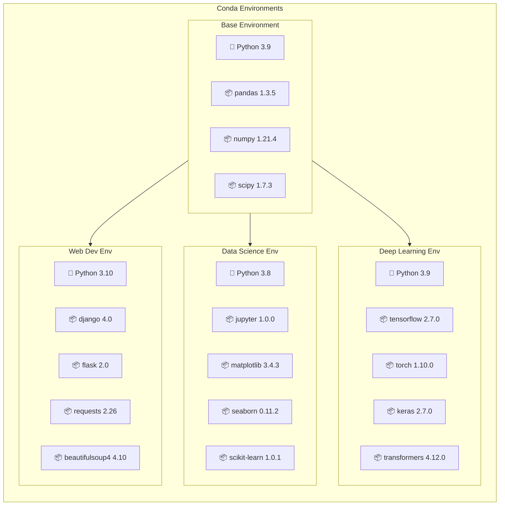

# 2nd_IGIB-ICMR_Workshop
1. Introduction to Core Unix Utilities
2. Introduction to Shell & BASH Scripting
3. Package Manager (Conda)
4. Bioinformatics Tools (seqkit, seqtk) 
---
### Sample file
```bash
wget https://ftp.ncbi.nlm.nih.gov/genomes/all/GCA/021/613/535/GCA_021613535.1_ASM2161353v1/GCA_021613535.1_ASM2161353v1_genomic.fna.gz
```
This is the link to download the DNA FASTA file of _Adineta vaga_ , We will use this file for practice 
#### Decompress `.gz` files

```bash
gunzip *.gz
```
Unzip the FASTA file 

---
### grep

`grep` (Global Regular Expression Print) is a command-line utility used to search for text patterns within files or data streams. It implements regular expression (regex) pattern matching, making it a powerful tool in data processing pipelines, log analysis, and bioinformatics workflows.

#### Example

```bash
grep "pattern" filename.txt
```

#### Rename a File
```bash
mv GCA_021613535.1_ASM2161353v1_genomic.fna sequence.fasta
```

#### Extract FASTA Headers
```bash
grep "^>" sequence.fasta
```
```
output

>CP075493.1 Adineta vaga breed AD008 chromosome 1
>CP075495.1 Adineta vaga breed AD008 chromosome 2
>CP075492.1 Adineta vaga breed AD008 chromosome 3
>CP075496.1 Adineta vaga breed AD008 chromosome 4
>CP075494.1 Adineta vaga breed AD008 chromosome 5
>CP075497.1 Adineta vaga breed AD008 chromosome 6
```

#### Match Lines Ending with a Pattern
```bash
grep "5$" sequence.fasta
```

```
output

>CP075494.1 Adineta vaga breed AD008 chromosome 5
```

#### Viewing a Log File

```bash
cat log_file.txt
```
```
output

[2025-02-01 08:12:01] Starting workflow: RNA-seq processing v2.4.1

--- FastQC Summary ---
[2025-02-01 08:12:05] Sample 782001: Per-base quality OK
[2025-02-01 08:12:05] Sample 782001: Adapter content flagged (WARN)
[2025-02-01 08:12:06] Sample 009421: Per-base quality OK
[2025-02-01 08:12:06] Sample 009421: K-mer bias detected
[2025-02-01 08:12:07] Sample 55124: Low-quality tail (FAIL)
[2025-02-01 08:12:07] Sample 55124: Overrepresented sequences found

--- TrimGalore ---
[2025-02-01 08:13:10] Sample 782001: Trimmed 5,392,114 reads → 5,210,992 retained
[2025-02-01 08:13:12] Sample 009421: Trimmed 4,991,203 reads → 4,812,003 retained
[2025-02-01 08:13:14] Sample 55124: Trimmed 938,221 reads → 712,441 retained
[2025-02-01 08:13:14] WARNING: Adapter dimers detected in Sample 55124
[2025-02-01 08:13:16] Sample 128991: Trimmed 3,219,001 reads → 3,118,442 retained
[2025-02-01 08:13:17] Sample 12003: Failed during trimming: read-length collapse
[2025-02-01 08:13:17] ERROR: TrimGalore exited with code 1 for Sample 12003

--- STAR Alignment ---
[2025-02-01 08:14:30] Sample 782001: STAR alignment started
[2025-02-01 08:14:31] Sample 782001: 94.2% uniquely mapped; 3.1% multimapped
[2025-02-01 08:14:32] Sample 782001: Alignment completed successfully
[2025-02-01 08:14:40] Sample 009421: STAR alignment started
[2025-02-01 08:14:41] Sample 009421: 91.4% uniquely mapped; 5.8% multimapped
[2025-02-01 08:14:42] Sample 009421: Alignment completed successfully
[2025-02-01 08:15:10] Sample 128991: STAR alignment started
[2025-02-01 08:15:11] Sample 128991: Failed — reference mismatch detected
[2025-02-01 08:15:11] ERROR: Genome reference version incompatible for Sample 128991
[2025-02-01 08:15:12] CRITICAL: STAR index not found at /refs/hg38_v34/star/

--- RSEM Quantification ---
[2025-02-01 08:16:20] Sample 782001: Estimate read-start position distribution
[2025-02-01 08:16:21] Sample 782001: Successfully quantified transcripts
[2025-02-01 08:16:30] Sample 009421: Estimate read-start position distribution
[2025-02-01 08:16:31] Sample 009421: Successfully quantified transcripts
[2025-02-01 08:16:45] Sample 55124: Quantification skipped — previous alignment failed
[2025-02-01 08:16:46] FAILED: RSEM exited due to missing BAM file for Sample 55124

--- QC Aggregation ---
[2025-02-01 08:17:30] Computing TPM normalization…
[2025-02-01 08:17:31] Sample 782001: TPM normalization complete
[2025-02-01 08:17:32] Sample 009421: TPM normalization complete
[2025-02-01 08:17:33] Sample 55124: TPM normalization failed — insufficient mapped reads
[2025-02-01 08:17:34] WARNING: Low coverage on chromosome 17 for Sample 55124
[2025-02-01 08:17:36] ERROR: Cannot compute gene-level summary for Sample 55124

--- MultiQC Merge ---
[2025-02-01 08:18:10] Aggregating results across 6 samples…
[2025-02-01 08:18:11] Summary generated: multiqc_report.html

--- Final Notes ---
[2025-02-01 08:18:30] Completed workflow with 2 critical errors and 4 failed steps.
[2025-02-01 08:18:30] Failed samples: 55124, 12003, 128991
[2025-02-01 08:18:31] Successful samples: 782001, 009421

```

This is original content of log_file.txt


#### Searching Patterns in Logs

```bash
grep -E "[0-9]{6}" log_file.txt
```
The -E flag enables Extended Regular Expressions (ERE). Basic grep requires escaping {} for repetition. With -E, quantifiers like {6} work directly. [0-9] is the regular expression pattern. Matches any single digit from 0 to 9. {6} is a A quantifier. Means exactly six occurrences

```bash
grep "error" log_file.txt
```
It reads log_file.txt and prints only the lines that contain the word "error".

```bash
grep -i "error" log_file.txt
```
is used to search for the word “error” in log_file.txt without considering letter case.
It prints every line in log_file.txt that contains:
error
Error
ERROR
ErRoR
any other capitalization

---

### awk

`awk` is a powerful programming language and command-line utility used for **pattern scanning and text processing**.  
It processes input data **line by line (records)** and splits each line into **columns (fields)**, usually separated by spaces or tabs.  

It is widely used for:
- Column-based data manipulation
- Filtering rows based on conditions
- Extracting fields from structured files
- Bioinformatics data processing (FASTA, GTF, BED, FASTQ)


#### Viewing File Contents

Display the contents of a file.

```bash
cat expression.tsv
```
```
output

gene_id	sample1	sample2	sample4	logFC
BRCA1	12	14	11	2.1
TP53	5	19	17	8.2
EGFR	33	29	41	1.4
MYC	2	3	1	0.3
GAPDH	1000	1021	980	0.1

```
#### Extract Specific Columns

Print the **1st and 3rd columns** from a tabular file.

```bash
awk '{print $1, $3}' expression.tsv
```

Explanation:
- `$1` → first column  
- `$3` → third column  
- `print` → outputs selected fields  
- Default separator is a space.


#### Print Columns with Tab Separation

Print the **1st and 3rd columns separated by a tab**.

```bash
awk '{print $1 "\t" $3}' expression.tsv
```

Explanation:
- `"\t"` inserts a **tab character** between fields.


#### Filter Rows Based on a Condition

Print rows where the **value in column 5 is greater than 1**.

```bash
awk '$5 > 1' expression.tsv
```

Explanation:
- `$5` → fifth column
- `> 1` → condition applied to filter rows
- Only rows satisfying the condition are printed.


#### Display a GTF Annotation File

```bash
cat annotations.gtf
```

This prints the entire **GTF annotation file**, commonly used for gene annotations.
```
output

chr1	ENSEMBL	gene	1000	5000	.	+	.	gene_id "geneA"; gene_type "protein_coding";
chr1	ENSEMBL	exon	1000	1200	.	+	.	gene_id "geneA";
chr1	ENSEMBL	exon	2000	2300	.	+	.	gene_id "geneA";
chr1	ENSEMBL	gene	7000	9500	.	-	.	gene_id "geneB"; gene_type "lincRNA";
chr1	ENSEMBL	exon	7000	7200	.	-	.	gene_id "geneB";
chr2	ENSEMBL	gene	4000	6500	.	+	.	gene_id "geneC"; gene_type "protein_coding";
chr2	ENSEMBL	exon	4000	4300	.	+	.	gene_id "geneC";

```

#### Extract Gene Coordinates

Print chromosome, start, end, and strand for **gene entries**.

```bash
awk '$3=="gene" {print $1, $4, $5, $7}' annotations.gtf
```

Explanation:
- `$3=="gene"` → selects rows describing genes
- `$1` → chromosome
- `$4` → start coordinate
- `$5` → end coordinate
- `$7` → strand (+ or -)


#### Filter Only Exon Features

```bash
awk '$3=="exon"' annotations.gtf
```

Explanation:
- Filters rows where the **third column equals "exon"**.

#### Viewing regions.bed File Contents

Display the contents of regions.bed file.

```bash
cat regions.bed
```
```
output

chr1	1000	1500
chr1	2000	2600
chr2	3000	3300
chr2	100	500
chr3	5000	8000

```

#### Filter Rows by Chromosome

```bash
awk '$1 == "chr1"' regions.bed
```

Explanation:
- `$1` → chromosome column
- Prints rows that belong to **chromosome 1**.


#### Calculate Interval Length

Add a new column representing the **length of genomic intervals**.

```bash
awk '{print $0 "\t" $3 - $2}' regions.bed
```

Explanation:
- `$0` → entire line
- `$3 - $2` → interval length (end − start)
- `"\t"` adds the new value as another column.

#### Display read.fastq File

```bash
cat read.fastq
```
```
output

@SEQ001
ATGCGTAGTA
+
IIIIIIIIII
@SEQ002
TTATCGATCG
+
JJJJJJJJJJ
@SEQ003
GCGATCGTAA
+
HHHHHHHHHH

```

#### Extract Sequence Lines from FASTQ

```bash
awk 'NR%4==2' reads.fastq
```

Explanation:
- `NR` → current line number
- `NR % 4 == 2` → selects **every 2nd line in a 4-line FASTQ record**
- FASTQ format structure:

```
Line 1: @sequence_id
Line 2: DNA sequence
Line 3: +
Line 4: quality scores
```

This command extracts **only the DNA sequence lines**.

---
### sed — Stream Editor

`sed` (Stream Editor) is a command-line utility used to **perform text transformations on streams of text or files**.  
It is commonly used for:

- Find and replace operations
- Deleting lines
- Extracting sections of files
- Formatting text
- Simple automated editing of files

It processes input **line by line** and applies editing commands.

#### Remove Prefix at Beginning of Line

Remove `"chr"` only if it appears at the **start of a line**.

```bash
sed 's/^chr//' regions.bed
```

Explanation:
- `s` → substitute command  
- `^chr` → matches `"chr"` only at the **beginning of a line**  
- Replaces it with nothing (effectively deleting it).


#### View File Contents

```bash
cat annotations.gtf
```

Displays the contents of the **GTF annotation file**.


#### Find and Replace Text

Replace `"chr"` with `"scaffold_"` in the file output.

```bash
sed 's/chr/scaffold_/g' annotations.gtf
```

Explanation:
- `s` → substitute
- `chr` → search pattern
- `scaffold_` → replacement
- `g` → replace **all matches in each line**.

#### Replace Text In-Place

Modify the file directly instead of printing to the terminal.

```bash
sed -i 's/chr/scaffold_/g' annotations.gtf
```

Explanation:
- `-i` → edit the file **in place**.

#### Revert Replacement

Replace `"scaffold_"` back to `"chr"`.

```bash
sed -i 's/scaffold_/chr/g' annotations.gtf
```

#### View Updated File

```bash
cat annotations.gtf
```

Displays the modified file.

#### View FASTA File

```bash
cat sequence2.fasta
```
```
output

>gene123
ATGCGTAGTCAGTCTAGCTAGCATCGAT
>geneA
ATGCGGATCGATCGTAGCTAGGCTAA
>geneB
TTGCGATCGATCGATTTTTAGCGATCGA
>geneXYZ
GCGCGCGATATATATAGCGCGCGTATAT

```
Shows the FASTA sequence file.

#### Remove FASTA Headers

Delete lines starting with `>` (FASTA header lines).

```bash
sed '/^>/d' sequence2.fasta
```

Explanation:
- `/^>/` → matches lines beginning with `>`
- `d` → deletes those lines.


#### View VCF File

```bash
cat variants.vcf
```
```
output

##fileformat=VCFv4.2
##source=FreeBayes
#CHROM	POS	ID	REF	ALT	QUAL	FILTER	INFO
chr1	10500	.	A	G	40	PASS	DP=12
chr1	10520	rs123	C	T	99	PASS	DP=20
chr2	9999	.	G	A	5	LowQual	DP=3

```

Displays the variant file.

#### Remove Comment Lines from VCF

```bash
sed '/^#/d' variants.vcf
```

Explanation:
- `/^#/` → matches lines beginning with `#`
- `d` → deletes comment lines.

#### Extract Lines Between Two Markers

Extract a specific FASTA entry.

```bash
sed -n '/^>gene123/,/^>/p' sequence2.fasta
```

Explanation:
- `-n` → suppress automatic printing
- `/^>gene123/` → start at header `gene123`
- `/^>/` → stop at next FASTA header
- `p` → print the selected region.

#### View gff File

```bash
cat file.gff
```
```
output

chr1	ensembl	gene	1000	1500	.	+	.	ID=gene1
chr1	ensembl	exon	1000	1200	.	+	.	Parent=gene1
chr2	ensembl	gene	3000	3500	.	-	.	ID=gene2
```

#### Replace Tabs with Spaces

```bash
sed 's/\t/ /g' file.gff
```

Explanation:
- `\t` → tab character
- Replaces each tab with a space.

#### View Multiple Spaces File

```bash
cat multispace_file.txt
```
```
output

Chromosome start end
chr1     20       30
chr2  35  50
chr3 68       90
chr4   36   68
```

#### Collapse Multiple Spaces

```bash
sed 's/  */ /g' multispace_file.txt
```

Explanation:
- `  *` → matches two or more spaces
- Replaces them with a **single space**.


#### Convert FASTA Sequences to Lowercase

```bash
sed '/^>/! s/.*/\L&/' sequence2.fasta
```

Explanation:
- `/^>/!` → apply command to **non-header lines only**
- `\L` → convert text to lowercase
- `&` → entire matched line.


#### Convert FASTA Sequences to Uppercase

```bash
sed '/^>/! s/.*/\U&/' sequence2.fasta
```

Explanation:
- `\U` → converts text to uppercase
- Headers remain unchanged.

#### Create Backup While Editing

```bash
sed -i.bak 's/sample3/sample4/g' expression.tsv
```

Explanation:
- `-i.bak` → edit file and **create a backup** with `.bak` extension.


#### View Backup File

```bash
cat expression.tsv.bak
```

Displays the backup copy.

#### Delete the First N Lines

Delete the first **4 lines** of the file.

```bash
sed '1,4d' expression.tsv
```

Explanation:
- `1,4` → line range
- `d` → delete those lines.

---
### cut

`cut` is a command-line utility used to **extract specific columns or character ranges from each line of a file**.  
It is commonly used for processing structured text files such as **TSV, CSV, and tabular bioinformatics data**.

Typical uses include:
- Extracting columns from tabular datasets
- Selecting specific character ranges
- Processing structured text files


#### View File Contents

```bash
cat expression.tsv
```

Displays the contents of the **TSV (tab-separated values) file**.


#### Extract Specific Columns from a TSV File

```bash
cut -f1,3 expression.tsv
```

Explanation:
- `-f` → specifies the **fields (columns)** to extract  
- `1,3` → extracts the **first and third columns**  
- Default delimiter for `cut` is a **tab**, which makes it suitable for TSV files.


#### View FASTA File

```bash
cat sequence2.fasta
```

Displays the contents of the FASTA sequence file.

#### Extract Specific Character Range

```bash
cut -c1-10 sequence2.fasta
```

Explanation:
- `-c` → selects **character positions**
- `1-10` → extracts **characters from position 1 to 10** from each line.

#### View CSV File

```bash
cat data.csv
```
```
output

SampleID,Species,Collection_Date,Reads,QC_Passed,Note
SMP001,Homo_sapiens,2024-01-12,15423000,YES,High depth
SMP002,Mus_musculus,2024-01-14,8723000,YES,OK
SMP003,Arabidopsis_thaliana,2024-02-01,4321000,NO,Low quality
SMP004,Escherichia_coli,2024-02-10,2210000,YES,Contaminated?
SMP005,Danio_rerio,2024-02-12,9540000,YES,Good sample
SMP006,Saccharomyces_cerevisiae,2024-03-02,11200000,NO,Library failed
SMP007,Homo_sapiens,2024-03-11,18900000,YES,Excellent depth
SMP008,Bacillus_subtilis,2024-03-15,1950000,YES,Short fragments
SMP009,Mus_musculus,2024-03-20,10120000,YES,Good
SMP010,Homo_sapiens,2024-03-21,5600000,NO,Adapter issues
```
Displays the contents of the **comma-separated values file**.


#### Extract Column from a CSV File

```bash
cut -d',' -f2 data.csv
```

Explanation:
- `-d','` → sets the **delimiter as a comma**
- `-f2` → extracts the **second column**.

This is useful when processing **CSV datasets where commas separate fields**.

---

### paste

`paste` is a command-line utility used to **merge lines from multiple files side-by-side**.  
It combines corresponding lines from each file into a single line, separated by a delimiter.

Common uses:
- Combining related datasets
- Creating tabular files from separate lists
- Merging columns from different files

#### View File Contents

```bash
cat merge_file1.txt
```
```
output

BRCA1
BRCA2
TP53
MYC
EGFR
```

Displays the contents of the first file.

```bash
cat merge_file2.txt
```
```
output

12.45
5.67
89.12
34.55
22.80
```
Displays the contents of the second file.

#### Merge Two Files Column-wise

```bash
paste merge_file1.txt merge_file2.txt
```

Explanation:
- `paste` reads the two files simultaneously.
- It merges corresponding lines from both files.
- By default, the columns are separated by a **tab character**.

Example output:

```
line1_file1    line1_file2
line2_file1    line2_file2
line3_file1    line3_file2
```

#### Create a TSV File from Two Lists

```bash
paste -d'\t' merge_file1.txt merge_file2.txt
```

Explanation:
- `-d` specifies a **custom delimiter**
- `'\t'` sets the delimiter as a **tab**
- This explicitly creates a **TSV (Tab-Separated Values) format**.

---

### sort

`sort` is a command-line utility used to **arrange lines of text files in a specified order**.  
It can sort data:

- Alphabetically
- Numerically
- By specific columns
- By multiple keys

It is widely used in **data preprocessing, log analysis, and bioinformatics pipelines**.

#### View File Contents

```bash
cat merge_file1.txt
```

Displays the contents of the file.

#### Sort a File Alphabetically

```bash
sort merge_file1.txt
```

Explanation:
- Sorts the lines **alphabetically** by default.

#### View Another File

```bash
cat merge_file2.txt
```

#### Sort the File

```bash
sort merge_file2.txt
```

Sorts lines alphabetically.

#### Sort Numerically

```bash
sort -n merge_file2.txt
```

Explanation:
- `-n` → performs **numeric sorting** instead of alphabetical sorting.

Example:
```
1
2
10
20
```

#### View Expression Data

```bash
cat expression.tsv
```

Displays a **tab-separated expression dataset**.

#### Sort by a Specific Column

```bash
sort -k2,2n expression.tsv
```

Explanation:
- `-k2,2` → sort by **column 2**
- `n` → numeric sorting

This sorts the file based on **numeric values in the second column**.

#### View BED File

```bash
cat regions.bed
```

Displays genomic interval data.

#### Bioinformatics Example: Sort BED File

```bash
sort -k1,1 -k2,2n regions.bed
```

Explanation:
- `-k1,1` → sort by **chromosome column**
- `-k2,2n` → then sort by **start position numerically**

This ensures genomic regions are **ordered correctly by chromosome and coordinate**.

### uniq

`uniq` is used to **filter or report repeated lines in a sorted file**.  
It is commonly used together with `sort`.

#### Extract Unique Values

```bash
cut -f1 regions.bed | sort | uniq
```

Explanation:
- `cut -f1` → extracts the first column
- `sort` → sorts values
- `uniq` → removes duplicate lines.

#### Count Unique Occurrences

```bash
cut -f1 regions.bed | sort | uniq -c
```

Explanation:
- `-c` → counts how many times each value appears.

Example output:

```
5 chr1
3 chr2
2 chr3
```

#### Find Duplicate Lines

```bash
cut -f1 regions.bed | sort | uniq -d
```

Explanation:
- `-d` → prints **only duplicated lines**.

#### Find Lines Appearing Once

```bash
cut -f1 regions.bed | sort | uniq -u
```

Explanation:
- `-u` → prints lines that appear **exactly once**.

---

### comm

#### Viewing a comm File

```bash
cat comm_file1.txt
```
```
output

ALK
BRCA1
BRCA2
EGFR
KRAS
MYC
TP53
```
```bash
cat comm_file2.txt
```
```
output

BRCA1
EGFR
FBXW7
KRAS
MYC
PIK3CA
TP53
```

`comm` compares **two sorted files line by line**.

It outputs three columns:

1. Lines unique to file1  
2. Lines unique to file2  
3. Lines common to both files  

#### Compare Two Files

```bash
comm comm_file1.txt comm_file2.txt
```

Explanation:
- Displays differences and similarities between the two files.

#### Show Only Common Lines

```bash
comm -12 comm_file1.txt comm_file2.txt
```

Explanation:
- `-1` → suppress column 1 (file1 unique lines)
- `-2` → suppress column 2 (file2 unique lines)

Result: only **shared lines** are displayed.

---
### wc: 
#### Count FASTQ Reads

```bash
wc -l reads.fastq | awk '{print $1/4}'
```

Explanation:
- FASTQ format has **4 lines per read**
- `wc -l` counts total lines
- `awk '{print $1/4}'` divides by 4 to get the **total number of reads**.

#### Print FASTA Headers

```bash
grep ">" sequence.fasta
```

Explanation:
- FASTA headers start with `>`
- This prints all sequence identifiers.

#### Count FASTA Sequences

```bash
grep ">" sequence.fasta | wc -l
```

Explanation:
- Counts the number of headers
- Each header corresponds to **one sequence**.

#### View FASTQ File

```bash
cat reads.fastq
```

Displays the FASTQ file contents.

#### Count FASTQ Reads Using Headers

```bash
grep "@" reads.fastq | wc -l
```

Explanation:
- FASTQ read headers begin with `@`
- Counting them gives the **number of reads**.

---

### Package Manager (Conda)

A **package manager** is a software tool that helps manage the installation and maintenance of software on a system.

A package manager can:

- Install software
- Update software
- Remove software
- Automatically manage dependencies

Package managers simplify software management and help maintain stable computing environments.

#### Dependency

A **dependency** is another software package or library that a program requires in order to function correctly.

For example, a bioinformatics tool written in Python may depend on:

- specific Python versions  
- additional libraries  
- other command-line tools  

Package managers automatically install these required dependencies.

#### Why Package Managers Are Needed

Without a package manager:

- Software must be installed **manually**
- **Version conflicts** between tools are common
- Dependencies may be missing
- Software can **break easily**
- Reproducing the same computational environment becomes difficult

Package managers solve these problems by **automatically managing software versions and dependencies**.


#### What is Conda?

**Conda** is an **open-source package manager and environment manager** widely used in scientific computing and bioinformatics.

Conda can:

- Install packages written in **multiple programming languages** (Python, R, C, C++)
- Automatically install required **dependencies**
- Create **isolated software environments**
- Manage **different versions of the same software**
- Work across **Linux, macOS, and Windows**

Because of these capabilities, Conda is commonly used to manage **bioinformatics software pipelines**.

#### What is a Conda Environment?

A **Conda environment** is an **isolated software workspace** that contains:

- A specific **Python version**
- Required **packages**
- All necessary **dependencies**

Each environment is independent, which means:

- Different projects can use **different software versions**
- Software conflicts are avoided
- Analyses can be **reproduced reliably**

For example, one environment may contain tools for **genome assembly**, while another contains tools for **RNA-seq analysis**.



---
### 🔧 Conda Installation & Bioinformatics Setup

#### 📥 Installation Steps

```bash
# Download Miniconda installer
wget https://repo.anaconda.com/miniconda/Miniconda3-latest-Linux-x86_64.sh

# Make installer executable
chmod +x Miniconda3-latest-Linux-x86_64.sh

# Run installation
./Miniconda3-latest-Linux-x86_64.sh

# Activate conda in current session
source ~/.bashrc
```

#### 🌿 Environment Management

```bash
# Create new environment named 'bio'
conda create -n bio

# Activate the environment
conda activate bio

# Install bioinformatics tools from bioconda channel
conda install -c bioconda seqkit
conda install bioconda::seqtk
```

#### 🧬 Bioinformatics Tools & Commands

#### ✅ Installation Verification

```bash
# Check versions
seqkit version
seqtk
```

---

#### 📊 SeqKit Commands - Sequence Analysis Toolkit

| Command | Description | Example |
|---------|-------------|---------|
| **Basic Statistics** | Count sequences in FASTA file | `seqkit stats sequence.fasta` |
| **Detailed Stats** | Show length, GC content, etc. | `seqkit stats sequence.fasta -a` |
| **Sequence Lengths** | Get sequence lengths with names | `seqkit fx2tab -l -n sequence.fasta` |
| **Filter by ID** | Extract specific sequence | `seqkit grep -p "CP075494.1" sequence.fasta` |
| **Format Conversion** | Convert to single-line FASTA | `seqkit seq -w 0 sequence.fasta > single_line.fa` |
| **Split Files** | Split into multiple parts | `seqkit split -p 2 sequence.fasta` |


---

### 🔧 Seqtk Commands - Sequence Toolkit

| Command | Description | Example |
|---------|-------------|---------|
| **FASTQ to FASTA** | Convert format | `seqtk seq -A reads.fastq > reads.fa` |
| **Reverse Complement** | Get reverse complement | `seqtk seq -r reads.fa > rc.fa` |


---

### BASH Scripting
A Bash script is a text file containing a series of shell commands that are executed automatically instead of typing them one by one in the terminal.
Bash scripting is mainly used for:
- Automation of repetitive tasks
- Running multiple commands in sequence
- File and directory management
```
#!/bin/bash

# Check arguments
if [ "$#" -ne 2 ]; then
    echo "Usage: bash simple_pipeline.sh <input_fasta> <output_prefix>"
    exit 1
fi

INPUT=$1
OUT=$2

# Extract FASTA headers (grep regex)
grep '^>' "$INPUT" > ${OUT}_headers.txt


# Convert sequence lines to lowercase (sed regex)
sed '/^>/! s/.*/\L&/' "$INPUT" > ${OUT}_lowercase.fa


# Sequence statistics using seqkit
seqkit stats "$INPUT" > ${OUT}_stats.txt


# Reverse complement sequences using seqtk
seqtk seq -r "$INPUT" > ${OUT}_revcomp.fa


# Format sequences to 60 bp per line
seqtk seq -l 60 ${OUT}_revcomp.fa > ${OUT}_revcomp_60.fa


echo "Done"
```

#### Script explanation

```
#!/bin/bash
```
Shebang - Tells the system to use bash interpreter to run this script

```
# Check arguments
if [ "$#" -ne 2 ]; then
    echo "Usage: bash simple_pipeline.sh <input_fasta> <output_prefix>"
    exit 1
fi
```
Argument Validation
- Checks if exactly 2 arguments are provided
- $# = number of arguments
- If not 2 → shows usage message and exits: Correct usage: bash simple_pipeline.sh input.fasta output

```
INPUT=$1
OUT=$2
```
Variable Assignment
- $1 = first argument (input FASTA file)
- $2 = second argument (output prefix)
- Stores them in named variables for clarity

```
# Extract FASTA headers (grep regex)
grep '^>' "$INPUT" > ${OUT}_headers.txt
```
Header Extraction
- grep finds lines starting with > (FASTA headers)
- Saves to [output_prefix]_headers.txt

```
# Convert sequence lines to lowercase (sed regex)
sed '/^>/! s/.*/\L&/' "$INPUT" > ${OUT}_lowercase.fa
```
Lowercase Conversion
- sed command: for lines NOT starting with > (/^>/!)
- Convert entire line to lowercase (\L&)
- Preserves headers (they start with >)
- Saves to [output_prefix]_lowercase.fa

```
# Sequence statistics using seqkit
seqkit stats "$INPUT" > ${OUT}_stats.txt
```
Sequence Statistics
- Uses seqkit stats to analyze the FASTA file
- Generates: file format, sequence count, total length, GC content, etc.
- Saves to [output_prefix]_stats.txt

```
# Reverse complement sequences using seqtk
seqtk seq -r "$INPUT" > ${OUT}_revcomp.fa
```
Reverse Complement
- seqtk seq -r = reverse complement each sequence
- A→T, T→A, G→C, C→G, and reverses order
- Saves to [output_prefix]_revcomp.fa

```
# Format sequences to 60 bp per line
seqtk seq -l 60 ${OUT}_revcomp.fa > ${OUT}_revcomp_60.fa
```
 Format Sequences

- Takes reverse complement file
- -l 60 = wraps sequences to 60 characters per line
- Makes files more readable and compatible with some tools
- Saves to [output_prefix]_revcomp_60.fa

```
echo "Done"
```
Completion Message
- Prints "Done" to indicate successful execution


